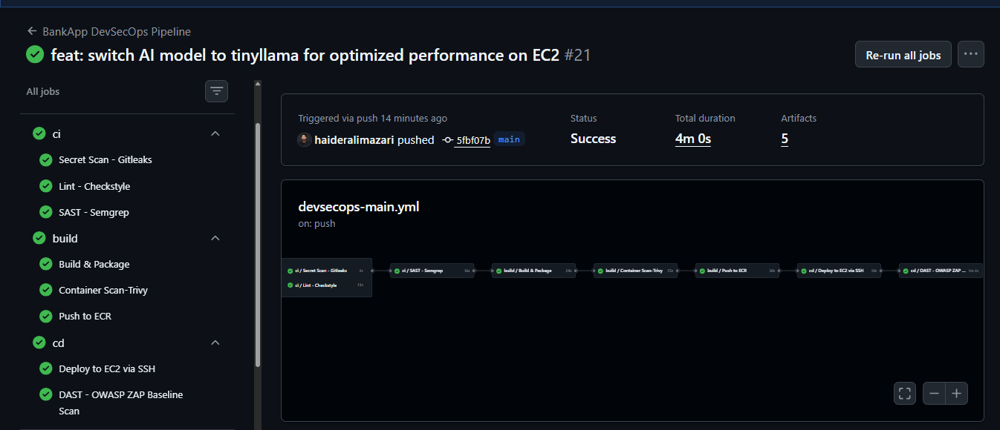
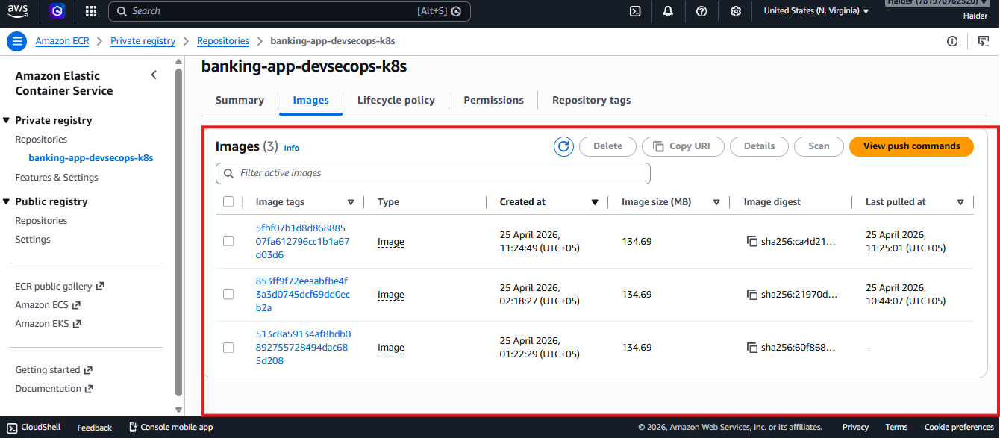
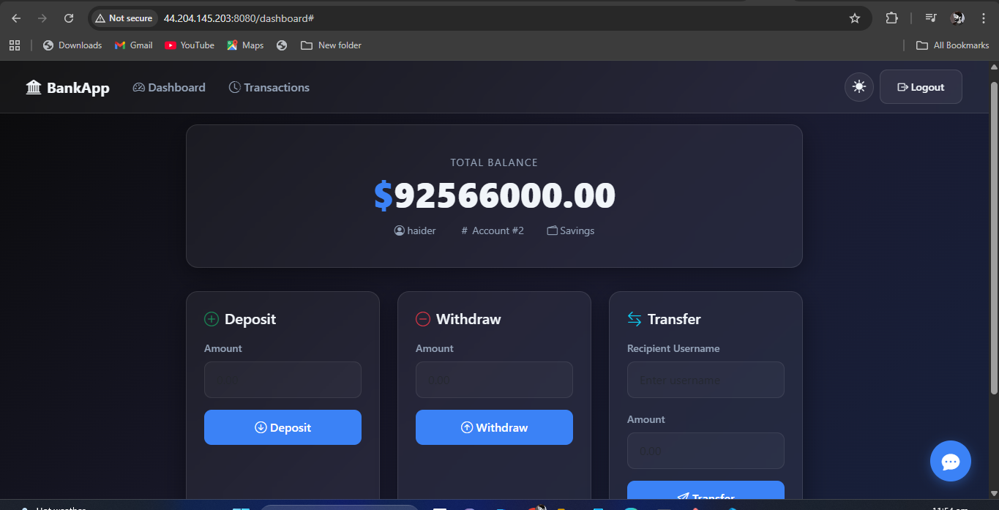
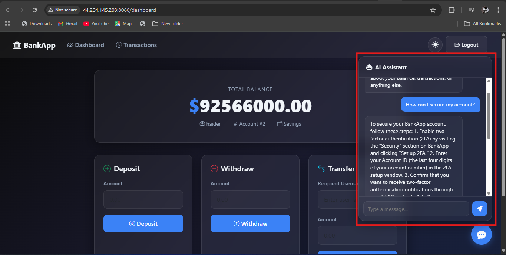
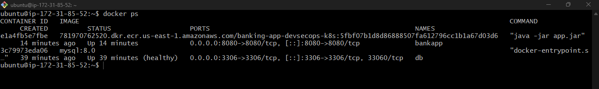

<div align="center">

# BankApp DevSecOps Pipeline

**A fully automated, security-first CI/CD lifecycle for a containerized Banking Application — from commit to cloud, with AI built in.**

<br>


</div>

---

## ✦ Key Features

| | Feature | Description |
|---|---|---|
| ⚡ | **Full CI/CD Pipeline** | Automated build, test, and deployment using GitHub Actions — triggered on every push to main. |
| 🛡️ | **Security First** | Integrated Secret Scanning (Gitleaks), SAST (Semgrep), Container Scanning (Trivy), and DAST (OWASP ZAP). |
| ☁️ | **Cloud Infrastructure** | Containerized deployment on AWS EC2 with Amazon ECR for versioned image management. |
| 🔐 | **Secrets Management** | Secure handling of DB credentials and API keys via AWS Secrets Manager — zero hardcoded secrets. |
| 🤖 | **Local AI Assistant** | TinyLlama via Ollama runs on-premise for secure, private AI-powered banking queries with no data leakage. |
| 📦 | **Container Orchestration** | Docker Compose manages BankApp + MySQL 8.0 as healthy, networked containers on a single EC2 instance. |

---

## ✦ Pipeline Overview — Automated Security Gates

```
┌─────────────────────┐     ┌─────────────────────┐     ┌─────────────────────┐
│     CI / SECURITY   │────▶│     CI / BUILD       │────▶│     CD / DEPLOY      │
│                     │     │                     │     │                     │
│  ✓ Secret Scan      │     │  ✓ Build & Package  │     │  ✓ Deploy via SSH   │
│  ✓ Lint Check       │     │  ✓ Container Scan   │     │  ✓ DAST Scan        │
│  ✓ SAST Scan        │     │  ✓ Push to ECR      │     │  ✓ Verify Health    │
└─────────────────────┘     └─────────────────────┘     └─────────────────────┘
```

---

## ✦ Project Visuals — See It In Action

### `01` — Automated CI/CD Pipeline
> All stages passing — Secret Scan, Lint, SAST, Container Scan, ECR Push, EC2 Deploy, and OWASP ZAP — in 4 minutes flat.



---

### `02` — Amazon ECR — Container Registry
> Three versioned Docker images pushed to the private ECR repository, each tagged with a unique commit hash for full traceability.



---

### `03` — Live Application Dashboard
> BankApp running live on AWS EC2 at port 8080 — showing account balance, Deposit, Withdraw, and Transfer functionality.



---

### `04` — Integrated AI Assistant — TinyLlama
> The on-premise AI Assistant powered by Ollama + TinyLlama answers banking queries in real-time, with zero data leaving the server.



---

### `05` — Docker Container Status
> Both containers healthy — BankApp pulling the latest ECR image, and MySQL 8.0 running as the database backend on the EC2 instance.



---

## ✦ Tech Stack — Built With

| Category | Technology |
|---|---|
| ☕ Backend | Java / Spring Boot |
| 🐬 Database | MySQL 8.0 |
| 🐳 Containers | Docker & Docker Compose |
| ⚙️ CI/CD | GitHub Actions |
| ☁️ Cloud | AWS EC2 |
| 📦 Registry | Amazon ECR |
| 🔑 Secrets | AWS Secrets Manager |
| 🤖 AI Engine | Ollama (TinyLlama) |
| 🔍 Secret Scan | Gitleaks |
| 🧠 SAST | Semgrep |
| 🔬 Container Sec | Trivy |
| 🕷️ DAST | OWASP ZAP |

---

## ✦ Security Workflow — Every Push Is Verified

**`01` — Secret Scanning — Gitleaks**
Scans every commit for accidentally exposed credentials, API keys, tokens, and connection strings before they ever reach production.

**`02` — Static Application Security Testing — Semgrep**
Performs code-level analysis to detect injection flaws, misconfigurations, and security anti-patterns in the Java source code.

**`03` — Container Image Scanning — Trivy**
Checks the Docker image for known CVEs in base images, OS packages, and application dependencies before pushing to ECR.

**`04` — Dynamic Application Security Testing — OWASP ZAP**
Runs a ZAP Baseline Scan against the live deployed application to discover runtime vulnerabilities, XSS, and injection points.

---

## ✦ Getting Started — Run It Locally

**Prerequisites:** Docker, Docker Compose, Ollama, AWS CLI configured.

```bash
# 1. Clone the repository
git clone https://github.com/your-username/banking-app-devsecops.git
cd banking-app-devsecops
```

```bash
# 2. Pull TinyLlama via Ollama
ollama pull tinyllama
```

```bash
# 3. Start all services
docker-compose up -d

# 4. Verify containers are healthy
docker ps
```

---

<div align="center">

         BankApp DevSecOps Pipeline

`Java` · `Spring Boot` · `Docker` · `GitHub Actions` · `AWS` · `Ollama` · `TinyLlama`

</div>